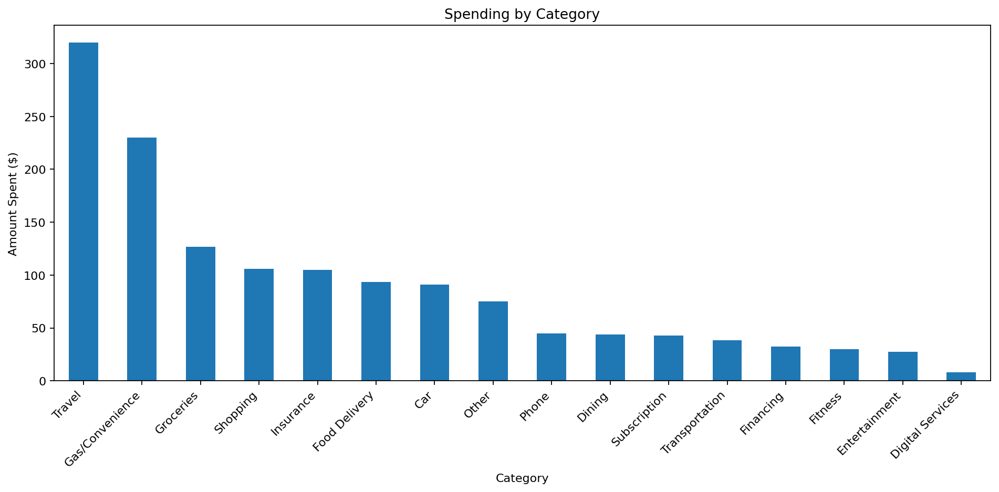
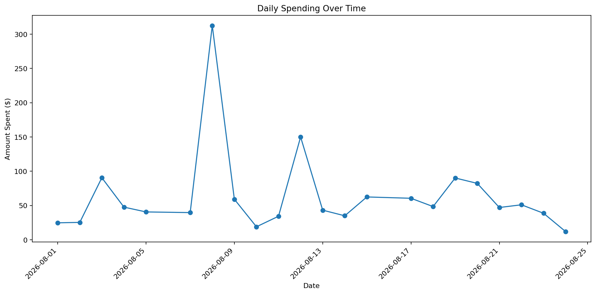

# Personal Finance Analyzer

A Python data-analysis project that turns raw bank transactions into a clean, categorized view of personal spending. The project uses Pandas and NumPy to classify transactions, standardize merchant names, calculate financial summaries, and visualize spending patterns with Matplotlib.

This repository also includes my learning notebook, which documents how the project developed from individual cleaning rules into a more organized and reusable analysis workflow.

## Project Highlights

- Loads and inspects transaction data from a CSV file
- Separates purchases, incoming money, transfers, and debt payments
- Cleans inconsistent merchant descriptions with reusable matching rules
- Maps merchants into meaningful spending categories
- Calculates money in, purchase spending, debt payments, transfers, and net cash flow
- Measures category totals and percentages of overall spending
- Visualizes category spending and daily spending trends

## Example Results

The included synthetic dataset produces the following summary:

| Metric | Amount |
| --- | ---: |
| Money In | $2,050.00 |
| Purchase Spending | $1,414.63 |
| Debt Payments | $185.00 |
| Transfers Out | $225.00 |
| Net Cash Flow | $225.37 |

Travel is the largest purchase category in the sample at 22.62%, followed by gas and convenience spending at 16.24%.





## Repository Contents

| File | Purpose |
| --- | --- |
| `PersonalFinanceAnalyzer.ipynb` | Final, streamlined version of the analysis |
| `LearningProgress.ipynb` | Step-by-step notebook showing the learning and development process |
| `data/sample_transactions.csv` | Synthetic sample data used by both notebooks |
| `assets/` | Charts generated from the sample data |
| `requirements.txt` | Python packages required to run the notebooks |

## How the Analysis Works

1. Load the transaction file and convert the date column to a datetime type.
2. Classify each row as money in, a transfer, a debt payment, or a purchase.
3. Standardize merchant names using regular-expression matching rules.
4. Map each cleaned merchant to a spending category.
5. Separate purchases from other financial movements.
6. Build financial and category-level summary tables.
7. Create charts showing category totals and daily spending.

## Run the Project

1. Clone this repository and open its folder.
2. Create and activate a Python virtual environment.
3. Install the required packages:

   ```bash
   pip install -r requirements.txt
   ```

4. Start Jupyter Notebook or JupyterLab:

   ```bash
   jupyter notebook
   ```

5. Open `PersonalFinanceAnalyzer.ipynb` and run the cells from top to bottom.

## Data Privacy

The original project was developed from a personal bank statement. That private statement is intentionally excluded from this repository. The included CSV is fully synthetic and contains sample descriptions, amounts, and balances created only to demonstrate the analysis.

If you adapt this project, keep real bank statements outside version control and use a private or anonymized dataset.

## Tools Used

- Python
- Pandas
- NumPy
- Matplotlib
- Jupyter Notebook

## Possible Next Steps

- Replace rule-based merchant matching with fuzzy matching
- Add monthly budget targets and variance analysis
- Build an interactive dashboard with Streamlit or Power BI
- Import multiple statement formats automatically
- Add anomaly detection for unusual transactions
